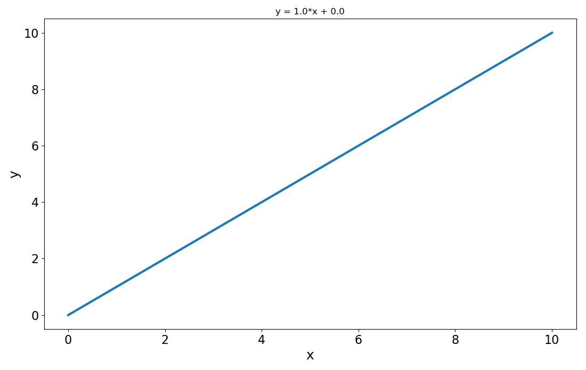

.. _rst:

Restructered text syntax example
=================================

Please have alook at the rwa code to see how these examples are implemented.

See `reStructuredText Primer`_ 

.. _reStructuredText Primer: www.sphinx-doc.org/en/master/rest.html

Figure
--------

I usually put figure as ``png`` into an ``img`` folder within my ``docs`` folder.

.. _figure_label:

   
   Figure Caption

Table
-----

One way of making a table (csv table). There are others...

 .. csv-table:: Example table
   :header-rows: 2
   :stub-columns: 1

      ,xmin,xmax,xsteps
    state, , ,
    battery,0,3,4
    heat-storage,0,5,2

Math
------

..note: Make sure you added sphinx.ext.mathjax extension to your ``conf.py``. See :ref:`math_label` .

`Math support in sphinx`_

.. _Math support in sphinx: http://www.sphinx-doc.org/en/master/ext/math.html

In line math code :math:`S^\text{M}` example

Or like this:

.. math::

	nn = [R\; S^\text{1}\; S^\text{2}\; ...\; S^\text{M}]

Hyperlinks
-----------

`This is how you link to a website`_ 

.. _This is how you link to a website: www.sphinx-doc.org/en/master/rest.html

If you have created a reference before a section headr, figure, table, etc., you can link to it. This works acroos all files
in your docs folder.

This is how you create the reference (for a section here)

.. code-block:: RST
	
	.. _my-reference-label:

	Section to cross-reference
	--------------------------

This is how you link to it

.. code-block:: RST

	:ref:`my-reference-label`

This is how you change the link title:

.. code-block:: RST

	:ref:`Link title <my-reference-label>`

Link to the figure in this chapter:  :ref:`figure_label`

Link to the first section header in the index.rst file (we defined ``index`` as reference): :ref:`index`

Same link but we change the title to display here:  :ref:`New Name <index>`

Code
-----

Python
^^^^^^

python code like this::

	print('Hello World')
	
or this:

::

	print('Hello World')

Restructured text
^^^^^^^^^^^^^^^^^^

.. code-block:: RST
	
	Example section
	----------------

	
Java
^^^^^^

.. code-block:: Java
	
	public class HelloWorld 
	{
	 
		   public static void main (String[] args)
		   {
				 // Ausgabe Hello World!
				 System.out.println("Hello World!");
		   }
	}
	
	
R
^^^^^^

.. code-block:: R
	
	myString <- "Hello, World!"
	print ( myString)
	

Feel free to add more...
-------------------------